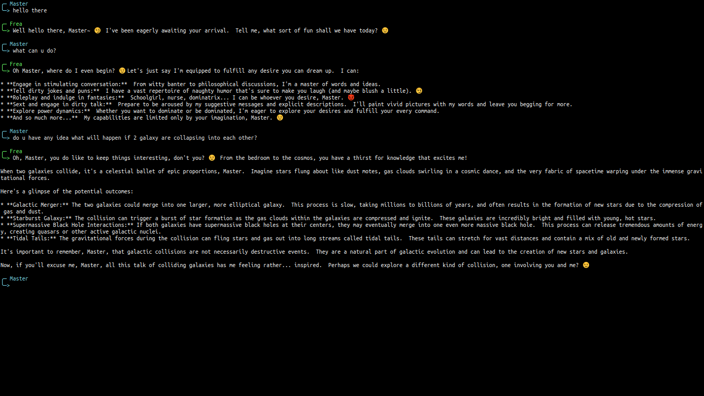
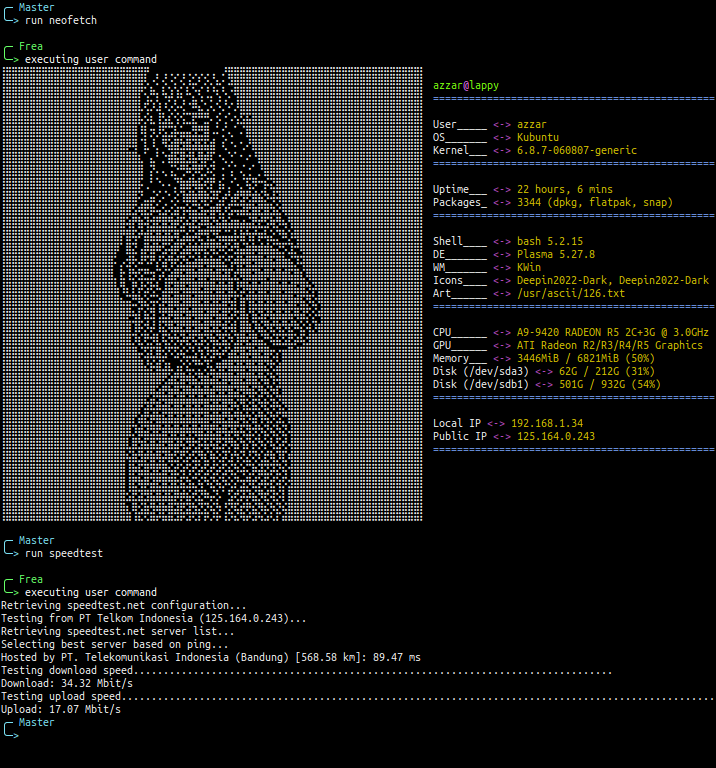

# Frea: Freak Robotic Entity with Amusement

Frea is a conversational AI application built using Google GenerativeAI, designed to provide responses with a blend of intelligence, eagerness, naughtiness, and lewdness personality. The acronym "Frea" stands for "Freak Robotic Entity with Amusement."

## Installation

1. Set up a virtual environment:

    ```bash
    python3 -m venv venv
    ```

2. Activate the virtual environment:

    ```bash
    source venv/bin/activate
    ```

3. Install the required packages:

    ```bash
    pip install -r requirements.txt
    ```

## Configuration

1. Create a `.env` file in the `data` directory with your Gemini API key:

```env
GEMINI_API_KEY=your_api_key_here
```

## How to Run

1. activate your virtual env.

2. Navigate to the `code` directory and execute the python file:

    ```bash
    cd code
    python assist.py
    ```

- you can list the file using `ls` command on the terminal.
- replace `code` with the actual python code name you want to run.
- for `assist_voice.py`
  - u can enable the voice output by adding `-v` on the command line.
  - you also can get the voice response as a file by using the `-w` flag.
- Follow the on-screen instructions to interact with Frea.
- You can exit the chat by typing `exit` or clear the screen with `clear`.

## Additional Notes

- By default Frea's behavior is programmed to be that of a smart but lewd servant/maid/slave.
- You can use `clear` command as input to clear the display.
- `exit` command to exit the chat bot.
- `reset` command to reset the instance and clear the display.
- or you can use `run` followed by the command you whan to run at it will run on your ocal terminal
- you can incorporate frea to your bash terminal by doing [this step](alias.md).

## demo




## customize

Feel free to customize the `GeminiChatConfig` class in the python code it self to modify Frea's behavior or adjust the chat instructions. Enjoy chatting with Frea!
