# Frea - Freak Robotic Entity with Amusement

## Table Of Content

1. [Overview](#Overview)
2. [Features](#Features)
3. [Setup](#Setup)
    - [Prerequisites](#Prerequisites)
    - [Installation](#Installation)
4. [Usage](#Usage)
    - [Running the Application](#Running-the-Application)
    - [Special Commands](#Special-Commands)
    - [Example Interaction](#Example-Interaction)
    - [Multi-Line Input](#Multi-Line-Input)
    - [Running Subprocess Commands](#Running-Subprocess-Commands)
5. [Configuration](#Configuration)
    - [Initial Configuration](#Initial-Configuration)
    - [Reconfiguration](#Reconfiguration)
6. [Developer Notes](#Developer-Notes)
    - [Code Structure](#Code-Structure)
    - [Functions](#Functions)
    - [Safety Settings](#Safety-Settings)
7. [Flowchart](#Flowchart)
8. [Demo](#Demo)

## Overview

Frea is an interactive terminal-based chat application powered by Google's generative AI, designed to provide seamless user interactions with advanced natural language processing capabilities. This application offers a variety of features, including multi-line input, special commands, and a customizable loading animation.

## Features

- **Interactive Chat Interface**: Engage in dynamic conversations with a generative AI model.
- **Customization**: Configure API keys, loading styles, and instruction files via `config.ini`.
- **Special Commands**: Use commands like `exit`, `clear`, `reset`, `print`, `reconfigure`, and `help`.
- **Multi-Line Input**: Easily handle multi-line user inputs.
- **Loading Animations**: Enjoy visually appealing loading animations while waiting for responses.
- **Safety Settings**: Ensure content safety with predefined thresholds for harmful content categories.
- **Conversation Log**: Save conversation logs to a file.
- **Model Switching**: Easily switch between different AI models.

## Setup

### Prerequisites

- Gemini API key
- Python 3.8 or later
- Required Python packages listed in `requirements.txt`

### Installation

1. **Clone the Repository**:
    ```bash
    git clone https://github.com/1999AZZAR/frea.git
    cd frea
    ```
2. **Create a virtual env**:
    ```bash
    python3 -m venv .venv
    ```
3. **Activate the venv**:
    ```bash
    source .venv/bin/activate
    ```

4. **Install Dependencies**:
    ```bash
    pip install -r requirements.txt
    ```

5. **Run the code**:
    ```bash
    cd code
    python main.py
    ```

6. **Configuration**:
    - On the first run, the application will prompt for the API key, loading style, and instruction file path.
    - These settings will be saved in a `config.ini` file for future use.

## Usage

### Running the Application

To start the Frea application, run:

```bash
cd src
python main.py
```

### Special Commands

- **exit**: Exit the application.
- **clear**: Clear the terminal screen.
- **reset**: Reset the chat session.
- **print**: Save the conversation log to a file.
- **reconfigure**: Reconfigure the settings.
- **help**: Display help information.
- **model**: Switch between models and services.

### Example Interaction

Upon running the application, you will see a prompt to enter your message:

```plaintext
╭─ User
╰─> Hello, how are you?
```

The application will respond after processing your input, showing a loading animation in the meantime.

### Multi-Line Input

To enter multi-line messages, end each line with a backslash (`\`):

```plaintext
╭─ User
╰─> This is a multi-line \
input example.
```

### Running Subprocess Commands

You can run system commands by prefixing them with `run `:

```plaintext
╭─ User
╰─> run ls -la
```

## Configuration

### Initial Configuration

On the first run, the application will guide you through creating a `config.ini` file:

```plaintext
╭─ Frea
╰─> No Configuration found. Creating configuration file.
Enter the API key: your_api_key_here
Enter the loading style (e.g., L1): L1
Enter the path to the instruction file: /path/to/instruction_file.txt
Configuration saved successfully!
```

You can get your own Gemini API key from [here](https://aistudio.google.com/app/apikey).

### Reconfiguration

To update the configuration at any time, use the `reconfigure` command within the application.

## Developer Notes

### Code Structure

- **Color**: Contains ANSI escape codes for terminal colors.
- **GeminiChatConfig**: Handles configuration, API initialization, and command processing.
- **GeminiChat**: Main class to run the chat application.

### Functions

- **cursor_hide()**: Hides the terminal cursor.
- **cursor_show()**: Shows the terminal cursor.
- **remove_emojis(text)**: Removes emojis from text.
- **run_subprocess(command)**: Executes a system command.
- **generate_chat()**: Main loop to handle user input and generate AI responses.

### Safety Settings

The application includes predefined safety settings to block harmful content categories:

- Harassment
- Hate Speech
- Sexually Explicit
- Dangerous Content

These settings can be adjusted in the `gemini_safety_settings` method.

## Flowchart

```mermaid
---
config:
  layout: elk
---
stateDiagram
  direction LR
  state HandleSpecialCommand {
    direction TB
    [*] --> CheckCommandType
    CheckCommandType --> ExitCommand:"exit"
    CheckCommandType --> ResetCommand:"reset"
    CheckCommandType --> ClearCommand:"clear"
    CheckCommandType --> HelpCommand:"help"
    CheckCommandType --> ReconfigureCommand:"recon"
    CheckCommandType --> SaveCommand:"save"
    CheckCommandType --> PrintCommand:"print"
    CheckCommandType --> ModelCommand:"model"
    ExitCommand --> [*]
    ResetCommand --> [*]
    ClearCommand --> [*]
    HelpCommand --> [*]
    ReconfigureCommand --> [*]
    SaveCommand --> [*]
    PrintCommand --> [*]
    ModelCommand --> [*]
    ExitCommand
    ResetCommand
    ClearCommand
    HelpCommand
    ReconfigureCommand
    SaveCommand
    PrintCommand
    ModelCommand
[*]    CheckCommandType
[*]  }
  state ProcessUserInput {
    direction TB
    SendMessageToAI --> DisplayResponse:Receive AI response
    [*] --> SendMessageToAI
    SendMessageToAI --> DisplayResponse
    DisplayResponse --> [*]
    SendMessageToAI
    DisplayResponse
[*][*]  }
  [*] --> Initialization
  Initialization --> ConfigurationLoaded:Load configuration
  ConfigurationLoaded --> ChatInitialized:Initialize chat session
  ChatInitialized --> WaitingForInput:Wait for user input
  WaitingForInput --> HandleSpecialCommand:User enters special command
  WaitingForInput --> HandleSubprocessCommand:User enters subprocess command
  WaitingForInput --> ProcessUserInput:User enters regular input
  HandleSpecialCommand --> ExitCommand:Command is "exit"
  HandleSpecialCommand --> ResetCommand:Command is "reset"
  HandleSpecialCommand --> ClearCommand:Command is "clear"
  HandleSpecialCommand --> HelpCommand:Command is "help"
  HandleSpecialCommand --> ReconfigureCommand:Command is "recon"
  HandleSpecialCommand --> SaveCommand:Command is "save"
  HandleSpecialCommand --> PrintCommand:Command is "print"
  HandleSpecialCommand --> ModelCommand:Command is "model"
  ExitCommand --> [*]:Exit application
  ResetCommand --> ChatInitialized:Reset chat session
  ClearCommand --> WaitingForInput:Clear terminal screen
  HelpCommand --> WaitingForInput:Display help information
  ReconfigureCommand --> ConfigurationLoaded:Reconfigure settings
  SaveCommand --> WaitingForInput:Save chat history
  PrintCommand --> WaitingForInput:Print chat history
  ModelCommand --> ChatInitialized:Change AI model
  HandleSubprocessCommand --> WaitingForInput:Execute subprocess command
  ProcessUserInput --> SendMessageToAI:Send user input to AI
  DisplayResponse --> WaitingForInput:Display response and wait for next input
```



## Demo

[](https://asciinema.org/a/663984)

> note:
> You can incorporate Frea into your bash terminal by following [this step](docs/alias.md).

